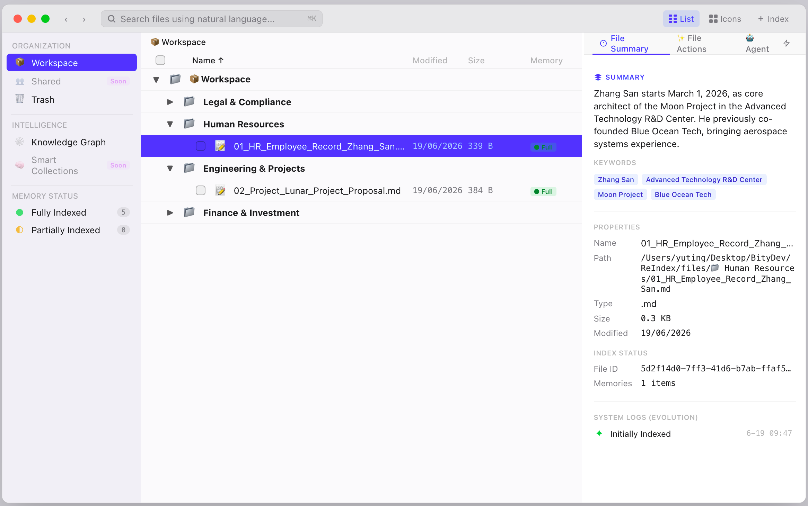
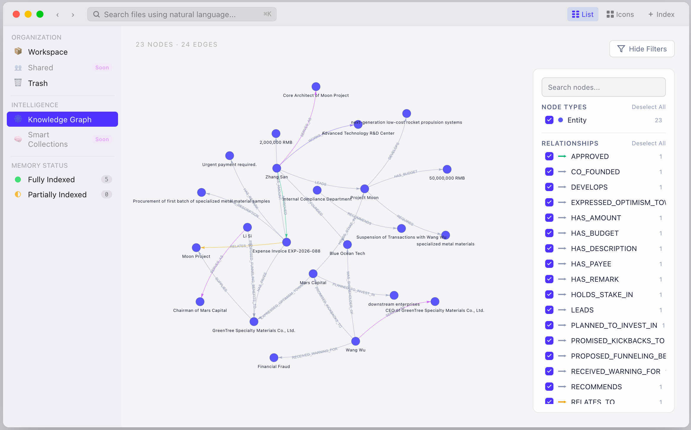
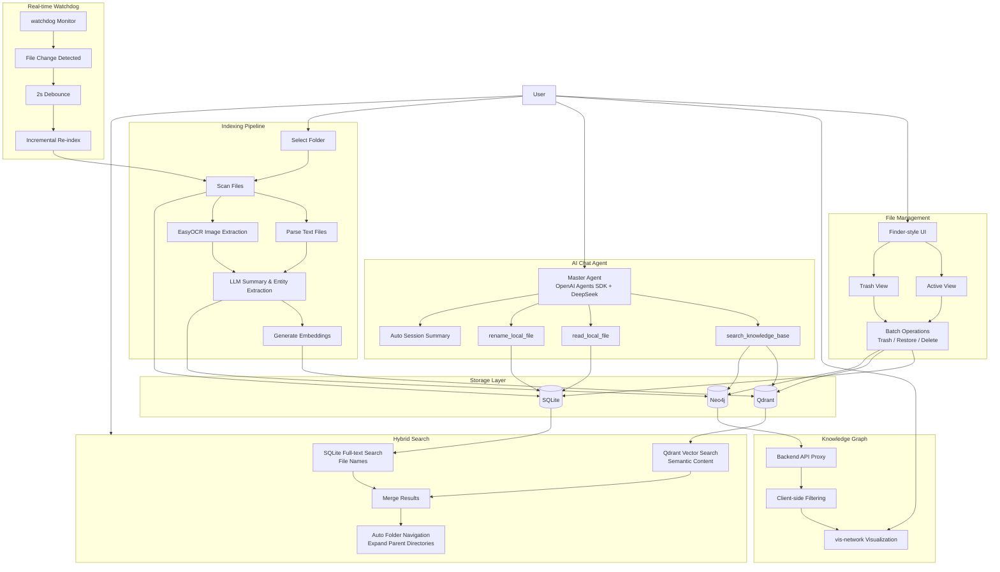

# reIndex

An intelligent file indexing and memory system.


 AI-powered semantic document management with graph-based knowledge representation and natural language search.

## Tech Stack

### Frontend
- **React 19** + **TypeScript** — UI framework
- **Vite 7** — build tool / dev server (port 1420)
- **vis-network + vis-data** — knowledge graph visualization (fetched via backend API proxy)
- **react-markdown + remark-gfm** — file preview rendering
- **Tauri 2** — optional desktop shell

### Backend
- **Python 3.12+** — runtime
- **FastAPI** — REST API server (port 8001)
- **SQLAlchemy** — ORM (SQLite: `data/reindex.db`)
- **Neo4j** — graph database (knowledge graph nodes & relationships)
- **Qdrant** — local vector database (semantic search, `data/qdrant_data/`)
- **Sentence Transformers** — local embedding model (`all-MiniLM-L6-v2`, 384-dim)
- **DeepSeek / OpenAI SDK** — LLM calls for summaries, entities, triplet extraction
- **OpenAI Agents SDK** — agent orchestration (master agent with tool access)
- **watchdog** — real-time filesystem monitoring
- **EasyOCR** — OCR for image content extraction (jpg, jpeg, png, bmp)
- **uvicorn** — ASGI server

### Infrastructure
- **Docker** — Neo4j container (auto-start on server boot)
- **AppleScript** — native macOS `choose folder` dialog

## Architecture

### Data Pipeline

```
Folder (AppleScript pick)
  → Scanner walks files recursively
    → Parser extracts content:
        plain text (.txt .md .py .csv .json .xml .html .css .js)
        images (.jpg .jpeg .png .bmp → EasyOCR)
        .pdf / .docx → stubs (not yet implemented)
      → SQLite stores file index & metadata (FileIndex, MemoryRecord, ChangeLog)
        → LLM generates summary & key entities
          → Summary embedding → Qdrant vector search
          → Triplet extraction → Neo4j knowledge graph
```

### Core Flow



### Database Schema (SQLite)

| Table | Purpose |
|---|---|
| `file_index` | File metadata, path, hash, soft-delete flag |
| `memory_record` | AI summary, key entities, full parsed text |
| `change_log` | Audit trail (CREATED, UPDATED, RENAMED, DELETED, RESTORED) |
| `chat_session` | Chat session grouping with auto-summary |
| `chat_message` | Individual messages per session |

### Graph Database Schema (Neo4j)

- **Node labels**: `File`, `Concept`, `Person`, `Organization`, `Location`, `Event`, etc.
- **Relationship types**: `RELATED_TO`, `MENTIONS`, `LOCATED_IN`, `CREATED_BY`, `PART_OF`, `WORKS_AT`, `INVESTED_IN`, etc. (all English `UPPER_SNAKE_CASE`)
- Each relationship stores `source_file = FileIndex.id` for per-file cleanup.

### Key Design Decisions

- **API proxy for graph**: Neo4j accessed through FastAPI backend (avoids CORS and credential exposure).
- **Client-side filtering**: Full graph dataset fetched; filtering runs in React `useMemo` for instant UI response.
- **`is_deleted` as truth source**: SQLite `FileIndex.is_deleted` controls trash state; Neo4j/Qdrant sync accordingly.
- **Debounced scanning**: `/api/scan` returns `"Scan already in progress"` if called concurrently.
- **Finder-style light theme**: SF Pro font, 0.5px dividers, pill-shaped sidebar, macOS accent blue (#006FFD).
- **Local embeddings**: `sentence-transformers/all-MiniLM-L6-v2` runs in-process (no external Ollama dependency).

## Getting Started

### 1. Clone & Install Dependencies

```bash
git clone <repo-url> && cd reindex

# ── Backend ──
cd backend
python -m venv .venv && source .venv/bin/activate
pip install -r requirements.txt
cd ..

# ── Frontend ──
cd frontend
npm install
cd ..
```

### 2. Start Neo4j (Docker)

```bash
docker run -d \
  --name neo4j_reindex \
  -p 7474:7474 -p 7687:7687 \
  -e NEO4J_AUTH=neo4j/reindex123 \
  neo4j:5
```

The backend tries to auto-start this container on boot; you can also use `docker start neo4j_reindex` / `docker stop neo4j_reindex`.

### 3. Configure Environment

```bash
cp backend/.env.example backend/.env
# Edit backend/.env with your API keys:
#   DEEPSEEK_API_KEY (required for LLM)
#   GOOGLE_API_KEY (optional, for Google ADK)
#   NEO4J_PASSWORD (must match docker run above)
```

### 4. Run Backend

```bash
cd backend
source .venv/bin/activate
python -m app.main
```

Server starts at `http://127.0.0.1:8001`.

### 5. Run Frontend

In a separate terminal:

```bash
cd frontend
npm run dev
```

Vite dev server starts at `http://localhost:1420`.

> **Tauri desktop app** (optional): `npm run tauri` builds a native window. Requires `cargo install tauri-cli` first.

## API Endpoints

| Endpoint | Method | Description |
|---|---|---|
| `/api/files` | GET | List files by status (`?status=active` / `trash`) |
| `/api/files/{id}` | GET | File details with AI summary |
| `/api/search` | GET | Semantic search (`?q=...`) |
| `/api/scan` | POST | Index a directory (`{"path": "..."}`) |
| `/api/system/choose_folder` | GET | Native macOS folder picker + auto-scan |
| `/api/batch-trash` | POST | Batch trash files |
| `/api/batch-restore` | POST | Batch restore files |
| `/api/batch-delete-permanent` | POST | Permanent delete (all stores) |
| `/api/graph/explore` | GET | Fetch graph nodes & edges |
| `/api/graph/schema` | GET | Available node labels & relationship types |
| `/api/directory/organize` | POST | LLM-based semantic folder organization |
| `/api/session` | POST | Create chat session |
| `/api/session/{id}` | GET | List messages in session |
| `/api/session/{id}/chat` | POST | Send message to agent |
